# Authentication Flow Diagram

This diagram illustrates the authentication architecture and flows in the Lang Memo application, based on the PRD and authentication specification.

## Authentication Flows

### 1. Sign Up Flow

### 2. Sign In Flow

```mermaid
sequenceDiagram
    participant User
    participant SignInForm
    participant AuthProvider
    participant Supabase
    participant LocalStorage

    User->>SignInForm: Enter credentials
    SignInForm->>AuthProvider: signIn(email, password)
    AuthProvider->>Supabase: auth.signInWithPassword()
    Supabase->>Supabase: Validate credentials
    Supabase->>Supabase: Check email verified
    alt Email Verified
        Supabase->>AuthProvider: Return session (access_token)
        AuthProvider->>LocalStorage: Store session
        AuthProvider->>SignInForm: Update state (isAuthenticated=true)
        SignInForm->>User: Redirect to returnUrl or /
    else Email Not Verified
        Supabase->>AuthProvider: Error: email_not_confirmed
        AuthProvider->>SignInForm: Show error + resend option
    end
```

### 3. API Request Flow (Authenticated)

### 4. Protected Page Access Flow

### 5. Session Expiration Flow

## Component Architecture

### Authentication Components Hierarchy

## Key Files and Responsibilities

| File | Responsibility |
|------|---------------|
| `src/components/providers/AuthProvider.tsx` | Client-side auth state management, Supabase client operations |
| `src/lib/auth.ts` | Server-side token validation (`getAuthenticatedUser`) |
| `src/middleware/index.ts` | Sets up Supabase client, handles protected routes (future) |
| `src/lib/api/cards.ts` | API client that includes auth tokens in requests |
| `src/pages/api/cards/*.ts` | Protected API endpoints that validate tokens |

## Security Considerations

1. **Token Storage**: Access tokens stored in localStorage (client) and HTTP-only cookies (server)
2. **Token Validation**: All API endpoints validate tokens server-side via `getAuthenticatedUser`
3. **Email Verification**: Required before sign-in (enforced by Supabase)
4. **Session Refresh**: Automatic token refresh handled by Supabase client
5. **Development Mode**: `DISABLE_AUTH` flag bypasses authentication for development

## Authentication States

